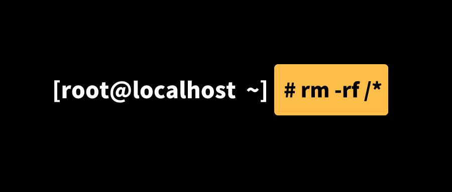

# Google zx English Version
## Introduction
[The most popular project for 2021 is ZX](https://anprettyboy.github.io/handsome-man/), a new tool from Google for writing simple command-line scripts in JavaScript or TypeScript.

Basically it lets you embed any bash expression in your code (ls, cat, git... Wait for any order!) And use the result of JavaScript [Template literals](https://developer.mozilla.org/en-US/docs/Web/JavaScript/Reference/Template_literals) with the [await operator]().

It introduces utilities provided by several popular packages:
 - [Node-fetch](https://github.com/node-fetch/node-fetch) has the same API as [Fetch](https://developer.mozilla.org/en-US/docs/Web/API/Fetch_API) in the browser to create HTTP requests.
 - [Fs-extra](https://github.com/jprichardson/node-fs-extra) handles file system operations.
 - [globby](https://github.com/sindresorhus/globby) matches a given filename in user-friendly mode.


## Background
["Bash is great, but when it comes to scripting, people often choose a more convenient programming language. JavaScript is a perfect choice, but the standard Node.js library requires extra hassle before it can be used. The ZX package provides a useful wrapper around child_process, escaping parameters and providing reasonable defaults."](https://github.com/google/zx)

### Topic


"Imagine that you wanted to delete: rm -rf $dir/ and then when dir is empty, what becomes? If $dir is empty, it is equivalent to executing rm -rf /, which deletes all files and folders... Then, your system did not, this is the legendary delete library run ~~~~"

## History


### Using javascript to write shell scripts
#! is a convention tag that tells the system what interpreter the script needs to run, that is, which shell to use. #! Known as shebang ([also known as Hashbang]((https://zh.wikipedia.org/wiki/Shebang))), such as bash：#! /bin/bash.

The simplest script
```shell
#!/usr/bin/env node
console.log('hello world');
To save the sample code above as test.js, execute the script with node, and get the output from the console.

Further, we give the script an execution permission:
```shell
chmod 755 test
```
#### Reads all files in a given folder
Read the current folder using the fs.readdirSync method, which returns an array of all subfolders or files under a given folder,

For example, I have a test folder in the current directory
```shell
test
├── 1.html
├── 1.txt
└── files
```
fs. ReaddirSync ('/test ') output for [' 1.html ', '1.txt' and 'files']

Create a new file, getFile, to store the script code

#### Unchanging folder
Read all files in a given directory and print the following code:
```shell
#!/usr/bin/env node

const testFolder = './test/';
const fs = require('fs');

fs.readdirSync(testFolder).forEach(file => {
  console.log(file);
});
```
#### Get user input
The given path of the above code is writable, we need to input it as a parameter, nodejs reads the user's input method:
```shell
const [nodeEnv,dir,...args]=process.argv //args is a parameter entered by the user
```
Modify the script code:
```shell
#!/usr/bin/env node

const fs = require('fs');
const [nodeEnv,dir,...args]=process.argv

// Gets the path entered by the user:
const folder=args[0]

fs.readdirSync(folder).forEach(file => {
  console.log(file);
});
```
The path can now be entered by itself when the script is executed:
```shell
node getFile your path
```
### A native way:child_process
Nodejs can use the child_process module to create a child process that executes the unit system command, as shown in the following example:
```shell
#!/usr/bin/env node


//-----Synchronous writing👇
const execSync=require('child_process').execSync

const res=execSync('ls')
console.log("res", res.toString())


// ----- Code asynchronously👇
const exec=require('child_process').exec
exec('ls',(err,stdout,stderr)=>{
   if(err)throw err
   console.log(stdout)
})
```
### Shelljs executes the Linux command line
First you need to install shellJS:
```
npm i shelljs -S
```
Shelljs provides many methods, the most common of which is the exec function, for example:
```shell
const shell=require('shelljs')
/**
 * Function signature:exec(command [, options] [, callback])
 * command:The command to be executed
 * callback:A callback function that processes the output of command
 * options:
 *  async: If provided by callback, this parameter is ignored and asynchronous execution is enforced (default: false).
 *  fatal: Exit upon error (default: false).
 *  silent: Whether to output in console(default: false).
 *  encoding: Set the encoding of stdout and stderr(default: 'utf8')
 */

//Output the result of ls:
shell.exec("ls")

//callback(code,stdout,stderr)  A code of 0 means success; otherwise, failure
shell.exec("dir",{silent:true},(code,stdout,stderr)=>{})

shell.exec('ls',{silent:true},(code,stdout,stderr)=>{
    console.log(code)
    console.log(stdout)
})
```

During development, the following commands are often encountered:
```shell
git add .
git commit -m 'your commit messages'
git push
```
1. Create a new file shell. Js under the root directory with the following contents:
```shell
let shell = require('shelljs')
let name = process.argv[2] || 'Auto-commit';
let exec = shell.exec

if (exec('git add .').code !== 0) {
    echo('Error: Git add failed')
    exit(1)
}
if (exec(`git commit -am "${name}"`).code !== 0) {
    echo('Error: Git commit failed')
    exit(1)
}
if (exec('git push').code !== 0) {
    echo('Error: Git commit failed')
    exit(1)
}
```
2. Perform all of the above tasks with a single command, added to package.json as follows:
```shell
"script":{
    "push":"node ./shell.js"
}
```
3. Execution
```shell
npm run push 'Test the ShellJS commit code'
```
### Use spawn to write cross-platform Node.js commands
If you want to write a cross-platform spawn command without incurring extra overhead, you can write it like this:
```shell
const process = require('process');
const { spawn } = require('child_process');

spawn('npm', {
 stdio: 'inherit',
 // Use the shell only when the current operating environment is Windows
 shell: process.platform === 'win32'
});

```
#### cross-spawn Third-party modules
关于 spawn 函数的跨平台写法，除了自己编写代码的时候做处理，也有第三方模块封装好了相关细节，如 cross-spawn。

使用该模块，可以在调用 spawn 函数时，自动根据当前的运行平台，来决定是否生成一个 shell 来执行所给的命令。对命令和参数中的字符进行转义更为方便。
### Google zx

“Bash is great, so I choose JavaScript”

What front-end development is good at is Javascript.
#### Installation and usage
```shell
npm i -g zx
```
Once zx is installed, write scripts in files with the.mjs suffix, or use the.js suffix, but use void async function () {... }() wraps the script.

Note  the following points when using:

#### 1、The script needs to contain the following headers:
```
#!/usr/bin/env zx
```
#### 2. Add execution permission before running it:
```
$ chmod +x ./script.mjs
$ ./script.mjs

# Or use this command:
$ zx ./script.mjs
```
#### zx Frequently used commands

##### $`command`
Using the exec function provided in the child_process package, you can execute the string as a command and return a Promise(ProcessOutput) object. Everything that passes ${... } are automatically escaped and referenced
```shell
let count = parseInt(await $`ls -1 | wc -l`)
console.log(`Files count: ${count}`)
```

To upload files in parallel,you can use the following scripts:
```shell
let hosts = [...]
await Promise.all(hosts.map(host =>
  $`rsync -azP ./src ${host}:/var/www`
))
```
To change the working path, use the CD () method:
```shell
cd('/tmp')
// output: /tmp
await $`pwd`
```
The fetch method wraps the [node-fetch](https://github.com/node-fetch/node-fetch) package:
```shell
let resp = await fetch('http://wttr.in')
if (resp.ok) {
  console.log(await resp.text())
}
```
The question() method wraps the [readline](http://nodejs.cn/api/readline.html) package:
```shell
type QuestionOptions = { choices: string[] }
function question(query: string, options?: QuestionOptions): Promise<string>
```
Usage:
```shell
let username = await question('What is your username? ')
let token = await question('Choose env variable: ', {
  choices: Object.keys(process.env)
})
```
For the [chalk](https://github.com/chalk/chalk) package, without importing it, you can use:
```shell
console.log(chalk.blue('Hello world!'))
```
[fs](http://nodejs.cn/api/fs.html) package, import can be directly used:
```shell
let content = await fs.readFile('./package.json')
```
[globby](https://github.com/sindresorhus/globby) package
The globby package.
```shell
let packages = await globby(['package.json', 'packages/*/package.json'])

let pictures = globby.globbySync('content/*.(jpg|png)')
```
os package
The os package.
```shell
await $`cd ${os.homedir()} && mkdir example`
```
path package
The [path](https://nodejs.org/api/path.html) package.
```shell
await $`mkdir ${path.join(basedir, 'output')}`
```

minimist package

The [minimist](https://www.npmjs.com/package/minimist) package.

Available as global const argv.
zx can also be imported from other scripts:
```shell
#!/usr/bin/env node
import {$} from 'zx'
await $`date`
```
Passing environment variables:
```shell
process.env.FOO = 'bar'
await $`echo $FOO`
```
Executing remote scripts:
```shell
zx https://your-remote-server.com/example-script.mjs
```

### Refrences
 - [How to Write Shell Scripts in Node with Google’s zx Library](https://www.sitepoint.com/google-zx-write-node-shell-scripts/)
 - [shelljs前端自动化](https://juejin.cn/post/6987307041321091079)
 - [使用javascript写shell脚本](https://juejin.cn/post/6992743763844005902)
 - [nodejs写bash脚本终极方案！](https://juejin.cn/post/6979989936137043999)
 - [ZX 用JavaScript写bash脚本](https://juejin.cn/post/7048286354861457416)
 - [nodejs写bash脚本终极方案！](https://juejin.cn/post/6979989936137043999#heading-4)
 - [zx, 如何用Javascript优雅的书写脚本命令](https://juejin.cn/post/7011464539141046279)
 - [Google zx 源码浅析](https://juejin.cn/post/7002536429314277384)
 - [Google 脚本工具 zx 使用教程](https://atomcloud.cn/google-script-tool-zx/)
 - [How to Write Shell Scripts in Node with Google’s zx Library](https://www.sitepoint.com/google-zx-write-node-shell-scripts/)
 - [Zx - a Tool for Writing Better Scripts](https://www.infoq.com/news/2021/05/zx-javascript-cli-scripts/)
 - [Write better bash scripts with Zx](https://blog.tericcabrel.com/write-a-better-bash-script-with-zx/)
 - [Create scripts in JavaScript with zx](https://blog.mastykarz.nl/create-scripts-javascript-zx/)
 - [Google ZX source code analysis](https://www.mo4tech.com/google-zx-source-code-analysis.html)
