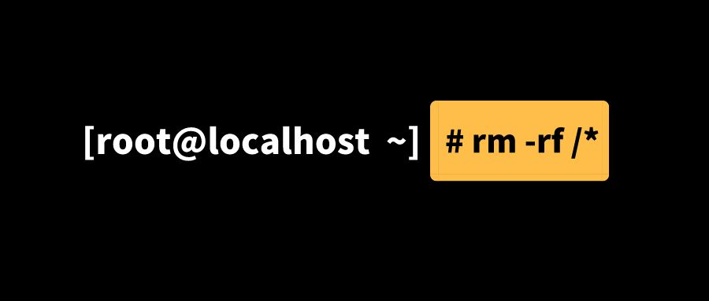

# Google zx


## 简介
年度流行项目是[zx](https://github.com/google/zx)，一个由谷歌推出的全新的工具，可用于以 JavaScript 或 TypeScript 编写简单的命令行脚本。

基本上它可以让你在代码中嵌入任何 bash 表达式（ls, cat, git...等任何命令！），并通过[await操作符](https://developer.mozilla.org/zh-CN/docs/Web/JavaScript/Reference/Operators/await)使用[JavaScript template literals](https://developer.mozilla.org/en-US/docs/Web/JavaScript/Reference/Template_literals)的结果。

它引入了由几个流行的软件包提供的实用工具：

 - [node-fetch](https://github.com/node-fetch/node-fetch) 与浏览器中[Fetch](https://developer.mozilla.org/en-US/docs/Web/API/Fetch_API)有着相同的 API， 可创建 HTTP 请求。
 - [fs-extra](https://github.com/jprichardson/node-fs-extra) 可处理文件系统操作。
 - [globby](https://github.com/sindresorhus/globby) 以用户友好模式来匹配给定的文件名。


## 背景
"Bash 很棒，但是在编写脚本时，人们通常会选择更方便的编程语言。 JavaScript 是一个完美的选择，但标准的 Node.js 库在使用之前需要额外的麻烦。 zx 包提供了围绕 child_process 的有用包装器，转义参数并提供合理的默认值。"

### 扔砖引玉


"想象一下，你本来想删除：rm -rf $dir/*然后dir是空的时候，变成了什么？rm -rf是删除命令，$dir是空的话，相当于执行 rm -rf /*,这是删除所有文件和文件夹。。。然后，你的系统就没了，这就是传说中的删库跑路吗~~~~"

## 历史


### 使用javascript写shell脚本
最简单的脚本
```
#!/usr/bin/env node
console.log('hello world');
```shell
保存为test，执行该脚本 node test,然后可以在控制台获得输出。

更进一步，我们给该脚本一个执行权限，
```shell
chmod 755 test
```
#### 例子-读取给定文件夹下所有的文件
读取当前文件夹使用 fs.readdirSync方法，该方法会返回一个数组，包含了给定文件夹下的所有子文件夹或文件,

举个栗子，在当前目录我有个test文件夹
```shell
test
├── 1.html
├── 1.txt
└── files
```
fs.readdirSync('./test') 的输出为 [ '1.html', '1.txt', 'files' ]

新建个文件，getFile，用来存放脚本代码

#### 写死的文件夹
读取给定目录下所有文件并输出的代码如下：
```shell
#!/usr/bin/env node

const testFolder = './test/';
const fs = require('fs');

fs.readdirSync(testFolder).forEach(file => {
  console.log(file);
});
```
#### 获取用户输入
以上代码的给定的路径是写死的，我们需要作为参数输入，nodejs读取用户输入的方法:
```shell
const [nodeEnv,dir,...args]=process.argv //args是用户输入的参数
```
修改脚本代码：
```shell
#!/usr/bin/env node

const fs = require('fs');
const [nodeEnv,dir,...args]=process.argv

// 获取用户输入的路径
const folder=args[0]

fs.readdirSync(folder).forEach(file => {
  console.log(file);
});
```
现在执行脚本时，路径就可以自己输入了
```shell
node getFile 你的路径
```
### 原生方式child_process
nodejs可以使用child_process模块新建子进程，用来执行unit系统命令，写个测试的例子，如下所示：
```shell
#!/usr/bin/env node


//-----同步写法👇
const execSync=require('child_process').execSync

const res=execSync('ls')
console.log("res", res.toString())


// ----- 异步写法👇
const exec=require('child_process').exec
exec('ls',(err,stdout,stderr)=>{
   if(err)throw err
   console.log(stdout)
})
```
### shelljs执行linux命令行
首先需要安装shelljs
```
npm i shelljs -S
```
shelljs提供了很多方法，最常用的是exec，举个栗子
```shell
const shell=require('shelljs')
/**
 * 函数签名：exec(command [, options] [, callback])
 * command:要执行的命令
 * callback:回调函数，对command的输出进行处理
 * options:
 *  async: 异步执行.如果callback提供了，会忽略该参数并强制异步执行  (default: false)
 *  fatal: Exit upon error (default: false).
 *  silent: 不在console中输出(default: false).
 *  encoding: 设置stdout和stderr的编码 (default: 'utf8')
 */

//输出ls的结果
shell.exec("ls")

//callback(code,stdout,stderr)  code为0则成功，否则失败
shell.exec("dir",{silent:true},(code,stdout,stderr)=>{})

shell.exec('ls',{silent:true},(code,stdout,stderr)=>{
    console.log(code)
    console.log(stdout)
})
```


在开发过程中，常会遇到如下命令：
```shell
git add .
git commit -m '*****'
git push
```
1. 在根目录下新建文件shell.js，内容如下：
```shell
let shell = require('shelljs')
let name = process.argv[2] || 'Auto-commit';
let exec = shell.exec

if (exec('git add .').code !== 0) {
    echo('Error: Git add failed')
    exit(1)
}
if (exec(`git commit -am "${name}"`).code !== 0) {
    echo('Error: Git commit failed')
    exit(1)
}
if (exec('git push').code !== 0) {
    echo('Error: Git commit failed')
    exit(1)
}
```
2. 只用一条命令执行以上所有任务，在package.json中加入,方法如下:
```shell
"script":{
    "push":"node ./shell.js"
}
```
3. 执行
```shell
npm run push 测试shelljs提交代码
```
### 用spawn 来编写跨平台 Node.js命令
如果想要编写跨平台的 spawn 命令，而又不想增加额外的开销的话，可以这样写
```shell
const process = require('process');
const { spawn } = require('child_process');

spawn('npm', {
 stdio: 'inherit',
 // 仅在当前运行环境为 Windows 时，才使用 shell
 shell: process.platform === 'win32'
});

```
#### cross-spawn第三方模块
关于 spawn 函数的跨平台写法，除了自己编写代码的时候做处理，也有第三方模块封装好了相关细节，如 cross-spawn。

使用该模块，可以在调用 spawn 函数时，自动根据当前的运行平台，来决定是否生成一个 shell 来执行所给的命令。对命令和参数中的字符进行转义更为方便。

### Google zx


Bash很好，所以我选择JavaScript

前端开发拿手的不就是 Javascript, 嗯 开整


### 部分资料参考
 - [shelljs前端自动化](https://juejin.cn/post/6987307041321091079)
 - [使用javascript写shell脚本](https://juejin.cn/post/6992743763844005902)
 - [nodejs写bash脚本终极方案！](https://juejin.cn/post/6979989936137043999)
 - [ZX 用JavaScript写bash脚本](https://juejin.cn/post/7048286354861457416)
 - [nodejs写bash脚本终极方案！](https://juejin.cn/post/6979989936137043999#heading-4)
 - [zx, 如何用Javascript优雅的书写脚本命令](https://juejin.cn/post/7011464539141046279)
 - [Google zx 源码浅析](https://juejin.cn/post/7002536429314277384)
 - [Google 脚本工具 zx 使用教程](https://atomcloud.cn/google-script-tool-zx/)
 - [How to Write Shell Scripts in Node with Google’s zx Library](https://www.sitepoint.com/google-zx-write-node-shell-scripts/)
 - [Zx - a Tool for Writing Better Scripts](https://www.infoq.com/news/2021/05/zx-javascript-cli-scripts/)
 - [Write better bash scripts with Zx](https://blog.tericcabrel.com/write-a-better-bash-script-with-zx/)
 - [Create scripts in JavaScript with zx](https://blog.mastykarz.nl/create-scripts-javascript-zx/)
 - [Google ZX source code analysis](https://www.mo4tech.com/google-zx-source-code-analysis.html)
